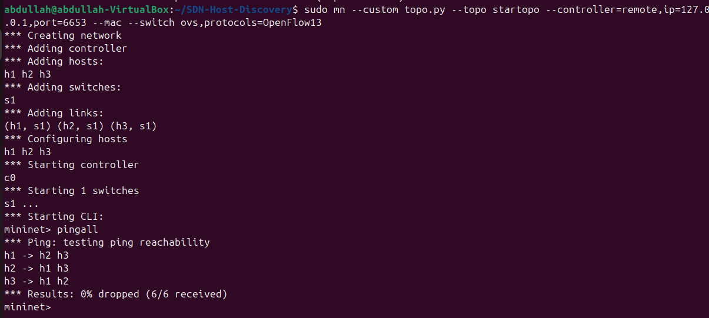
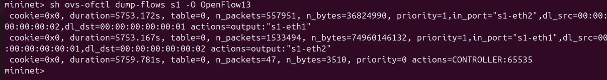
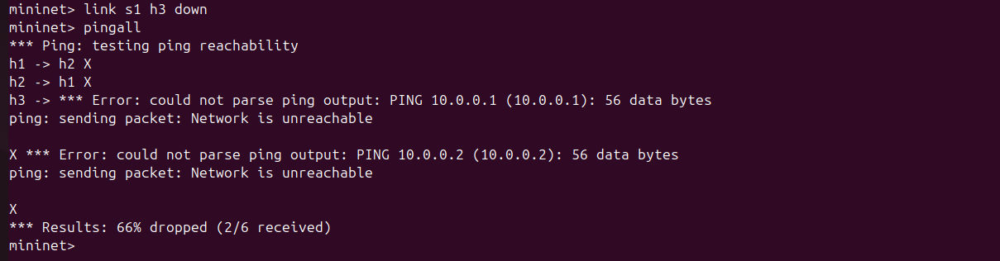

# SDN Host Discovery Service

## 1. Problem Statement
The goal of this project is to automatically detect and maintain a list of active hosts in an SDN network. The OpenFlow controller dynamically detects host join events (via ARP/IPv4 packets), maintains a live database of connected hosts with their MAC/IP/Port mappings, and updates dynamically.

## 2. Topology Justification & Design Choice
This project utilizes a **Star Topology** (1 OpenFlow switch connected to 3 hosts). 
* **Justification:** A central star topology forces all initial host traffic to pass through a single aggregation point. This ensures the Ryu controller intercepts all initial ARP broadcasts, making the edge-host discovery process reliable and clearly observable.

## 3. Setup and Execution Steps
This project was developed on Ubuntu using Mininet and the Ryu SDN Controller.

**Prerequisites:**
* Mininet (`sudo apt install mininet openvswitch-switch`)
* Ryu Controller (Running in a Python 3.9 virtual environment)

**Execution:**

1. **Start the Controller:**
   ```bash
   source ~/ryu_env/bin/activate
   cd src/
   ryu-manager host_discovery.py
   ```

2. **Start the Mininet Topology (in a new terminal):**
   ```bash
   cd src/
   sudo mn --custom topo.py --topo startopo --controller=remote,ip=127.0.0.1,port=6653 --mac --switch ovs,protocols=OpenFlow13
   ```

3. **Trigger Discovery:**
   In the Mininet CLI, run `pingall`.

## 4. Expected Output & Proof of Execution

### A. Functional Correctness (Host Discovery Log)
When hosts enter the network and send traffic, the controller successfully intercepts the `packet_in` events, extracts the IP/MAC addresses, and logs them dynamically.


### B. Performance Observation (Throughput)
Sustained TCP bandwidth testing between Host 1 and Host 2 using `iperf`.


### C. SDN Logic & Flow Rule Implementation
Verification that the Ryu controller successfully wrote L2 learning match-action flow rules into the Open vSwitch data plane.


### D. Validation / Failure Scenario
Testing network behavior when a physical link fails (`link s1 h3 down`). The network accurately reflects the unreachable state.

